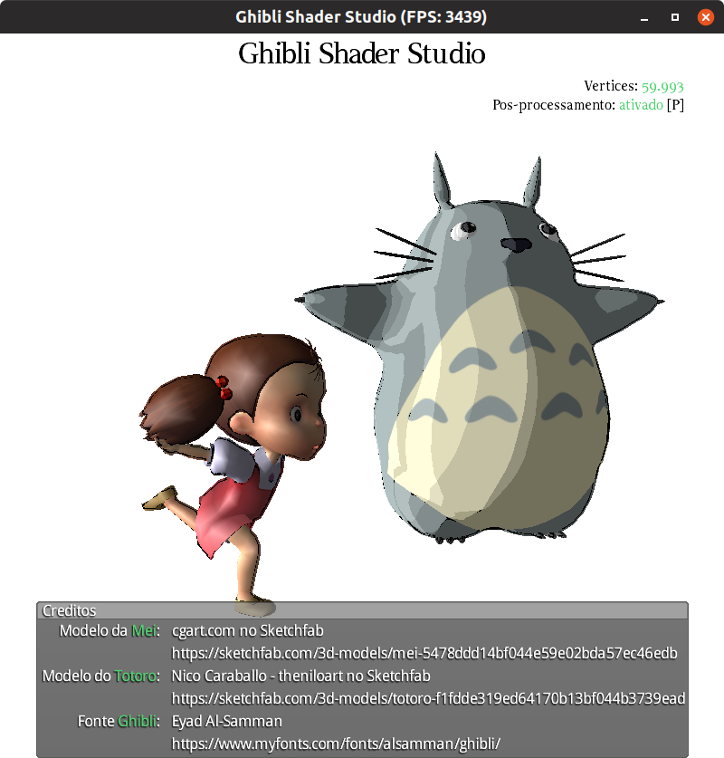

# Ghibli Shader Studio

Aprendendo colorir com os mestres da animação. Agora com pós-processamento 👍



## Atividade

Esta atividade prática contém 7 exercícios sendo que os seis primeiros são
obrigatórios. A cena está sendo renderizada em 2 passos, sendo que
a segunda etapa é a de pós-processamento (_shaders_ 
`post-process.vertex.glsl` e `post-process.fragment.glsl`). Contudo, a
função de pós-processamento não está fazendo nada ainda. Vamos implementar
alguns efeitos de pós-processamento. Todas as atividades serão feitas
no arquivo `core/assets/shaders/post-process.fragment.glsl`.

Para controlar a aplicação, você pode:

- Mouse:
  - Arraste com **botão esquerdo**:
  - Arraste com **botão do meio**:
  - Arraste com **botão direito**:
- Teclado:
    - <kbd>space</kbd>: pausa/retoma animação da Mei
    - <kbd>ESC</kbd>: sai da aplicação
    - <kbd>TAB</kbd>: faz a câmera focar na Mei ou no Totoro alternadamente
    - 🆕 <kbd>p</kbd>: ativa/desativa pós-processamento


### 1. Inverter cores

No _fragment shader_ de pós-processamento já existe uma função `vec3 inverter(vec3 cor)`,
só que ela está apenas retornando a cor recebida, sem modificá-la.

Implemente essa função corretamente de forma que cores brancas fiquem pretas,
pretas fiquem brancas, um tom de 0.3 vire 0.7 e vice-versa.

Lembre-se de chamar essa função e atribuir seu retorno à variável especial
do _fragment shader_ chamada `gl_FragColor` (`vec4`).

**Observação**: como a função retorna um `vec3`, mas precisamos preencher um
`vec4`, você deve criar um `vec4` a partir do `vec3`, com o valor 1.0 na 
coordenada _alpha_, tipo assim: `vec4(corEmRGB, 1.0)`.


### 2. Converter para escala de cinza

Agora, vamos fazer o efeito de pós-processamento para deixar a imagem em
escala de cinza. Crie uma função (eg, `vec3 paraCinza(vec3 cor)`) que 
recebe uma cor e retorna um tom de cinza.

Qualquer ~50 tons~ tom de cinza tem o mesmo valor para r, g e b. Logo,
para converter uma cor para um tom de cinza precisamos retornar algo como
`vec3(tomCinza, tomCinza, tomCinza)`. Mas quanto deve ser esse `tomCinza`?

Uma abordagem simples é tirar uma média aritmética dos valores de (r, g, b).
Contudo, estudos indicam que o olho humano é mais sensível a verde e menos
a azul. Logo, uma abordagem que agrada melhor os olhos é fazer uma **média
ponderada** usando os pesos (0.2989, 0.5879, 0.1140).

**Observação**: como a variável `tomCinza` é apenas um escalar (e não um vetor),
você pode usar o tipo de dados `float` para ela.

**Observação 2**: é possível usar a operação geométrica de **produto
escalar** (`dot(vetor1, vetor2)`) para calcular o `tomCinza` se houver 
um vetor de pesos e o outro com os valores.


### 3. Converter para colorização Sepia

[A cor sépia][sepia] é um tom de marrom que foi muito usado desde a Grécia antiga
como tinta para escrita e passou a ser presente também em obras de arte
até o final do século 19.

Para converter uma cor para sua versão em sépia, precisamos atribuir diferentes
valores para (r, g, b), como média ponderada usando os seguintes pesos:

```
          r       g       b
NovoR: 0.393   0.769   0.189
NovoG: 0.349   0.686   0.168
NovoB: 0.272   0.534   0.131
```

Ou seja, `NovoR = 0.393r + 0.769g + 0.189b` (da primeira linha) e daí 
por diante.

[sepia]: https://en.wikipedia.org/wiki/Sepia_(color)


### Convolução para borragem (_blur_)

Para borrar uma imagem misturamos os valores do pixel atual com os pixels
adjacentes (por exemplo, olhando na vizinhança 3x3).

Chamamos a operação que percorre uma imagem substituindo o valor do pixel
atual por uma combinação dos pixels vizinhos de **convolução** (2D).

A forma de combinar os pixels adjacentes ao pixel atual é feita como uma
média ponderada de seus valores. E o conjunto dos pesos usados é chamdo
de kernel, ou filtro da convolução.

Para borrar uma imagem, podemos fazer uma convolução com um kernel que
tira uma média aritmética apenas, ou seja, um kernel do tipo:

```
| 1.0   1.0   1.0 |
| 1.0   1.0   1.0 |   / 9.0 (para dividir pelo total)
| 1.0   1.0   1.0 |
```

A função `vec3 convolucao(textura, coordenada, kernel)` presente no
_shader_ `post-process.fragment.glsl` já está implementada e ela espera 
receber no 3º parâmetro qual é o kernel a ser usado.

Portanto, crie uma função `vec3 borrar(sampler2D textura, vec2 coordenada)`
que cria um kernel e chama a função de convolução, retornando o resultado
como a cor resultante do pixel.

Outro tipo de borragem é a gaussiana. Seu kernel é um pouco diferente:

```
| 1.0   2.0   1.0 |
| 2.0   4.0   2.0 |   / 16.0 (para dividir pelo total)
| 1.0   2.0   1.0 |
```

Teste a borragem gaussiana no seu programa. Crie uma função eg 
`vec3 borrar(textura, coords)` que faz essa operação
e utilize-a na `main`.


**Observação**: para representar um kernel você pode usar um _array_
de `float` usando a seguinte sintaxe do GLSL:

```glsl
float kernel[9];
kernel[0] = valor1;
kernel[1] = valor2;
kernel[2] = valor3;
...
```

### 5. Convolução de aguçamento

Use a função de convolução com um kernel que vai aguçar (_sharpen_)
a imagem. Um exemplo de kernel que faz isso é:

```
|-1.0  -1.0  -1.0 |
|-1.0   9.0  -1.0 |
|-1.0  -1.0  -1.0 |
```

Crie uma função eg `vec3 agucar(textura, coords)` que faz essa operação
e utilize-a na `main`.


### 6. Convolução de detecção de bordas

Use a função de convolução com um kernel que vai detectar bordas
(na verdade, realçá-las) na imagem. Um exemplo de kernel que faz isso é:

```
| 1.0   1.0   1.0 |
| 1.0  -9.0   1.0 |
| 1.0   1.0   1.0 |
```

Crie uma função eg `vec3 bordas(textura, coords)` que faz essa operação
e utilize-a na `main`.

### [Opcional] 7. Pós-processamento de _Toon Shading_

Tendo essas operações disponíveis, é possível adaptar o _Cell Shading_
em _Toon Shading_ (colore por células + contornos pretos realçados).

Uma forma possível é aplicar a convolução de detecção de bordas,
converter o resultado para escala de cinza e inverter a cor (para que
as bordas mudem de branco para preto).

Daí, caso a cor do fragmento não seja próxima de branco, quer dizer
que ele é um fragmento de contorno. Nesse caso (`if`), estamos em 
um contorno - logo, retorne a cor preta. Do contrário, não
estamos em um contorno - retorne simplesmente a cor da textura.


## FAQ

### Como fazer a renderização em 2 passos?

Para fazer a renderização em 2 passos é necessário, no primeiro,
"renderizar para uma textura". Isso é feito usando um recurso chamado
_Frame Buffer Object_ (FBO), que é o cara que armazenará a textura
onde a cena será renderizada.

No segundo passo, apenas 4 vértices são submetidos para o pipeline,
com a textura do FBO associada e usando o _shader_ de pós-processamento.

As modificações que foram feitas no programa para fazer a renderização
em dois passos são basicamente as presentes no seguinte _diff_:

Diff online: [https://www.diffchecker.com/6umlX9qk](https://www.diffchecker.com/6umlX9qk)