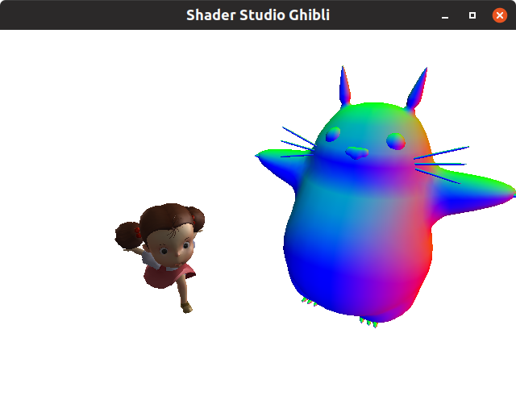
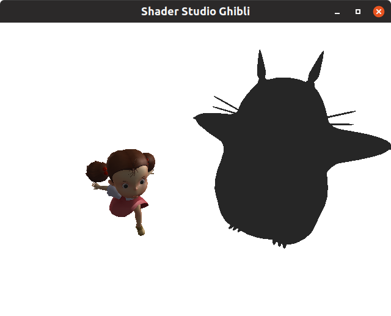
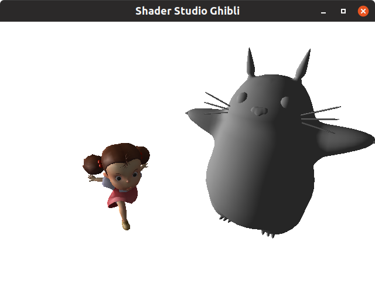
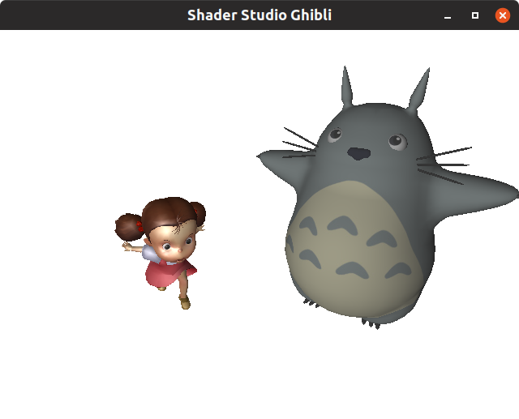
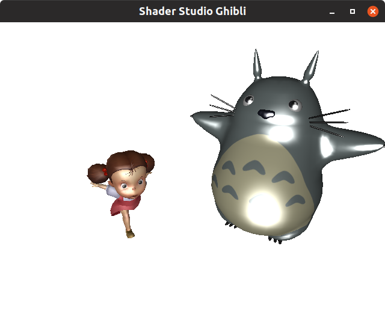
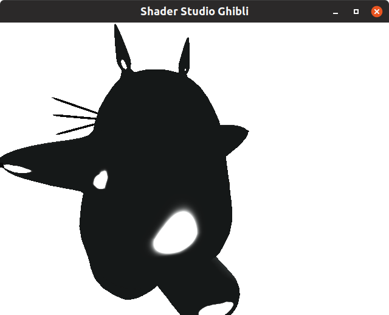

# Ghibli Shader Studio

Aprendendo colorir com os mestres da animação.


## Atividade

Esta atividade prática contém 3 exercícios obrigatórios e outros opcionais, 
dentre os quais você deve tentar fazer ao menos 1. Inicialmente, a cena
está colorindo cada fragmento do Totoro usando o valor do vetor normal:



Vamos usar os modelos de iluminação e sombreamento de Phong. Para lembrar
como ele funciona, veja o [FAQ](#faq).

Para controlar a aplicação, você pode:

- Mouse:
  - Arraste com **botão esquerdo**:
  - Arraste com **botão do meio**:
  - Arraste com **botão direito**:
- Teclado:
    - <kbd>space</kbd>: pausa/retoma animação da Mei
    - <kbd>ESC</kbd>: sai da aplicação
    - <kbd>TAB</kbd>: faz a câmera focar na Mei ou no Totoro alternadamente


### 1. _Shader_: componente ambiente

No _fragment shader_, você deve colocar como a cor resultante do fragmento
a componente ambiente de Phong. Esse valor pode ser simplesmente uma cor
constante, próxima de preto eg (0.15, 0.15, 0.15, 1.0). O resultado desta etapa
deve ser tipo:



**Observação**: o GLSL é lindo, mas tem um negócio chato. Se você tentar criar
um `vec4` da forma `vec4(0.15, 0.15, 0.15, **1**)` (sem o `.0`) ele vai dar
erro de compilação, com uma mensagem bem confusa. Portanto, lembre-se sempre
de colocar `.0` nos seus números inteiros.


### 2. _Shader_: componente difusa

No _fragment shader_, agora você vai implementar a componente difusa do
modelo de Phong. Se olharmos para o modelo, veremos que essa componente (D)
pode ser calculada como

```
D = máximo(0.0, n . s) * corDaLuz
```

O vetor `n` é o vetor normal do fragmento atual. Ele é um `varying`, ou seja,
um valor específico de cada fragmento que é calculado lá no _vertex shader_
e passado adiante. Na verdade, o _vertex shader_ calcula o vetor normal de cada
vértice, que serão interpolados para saber o valor da normal de cada fragmento.

O vetor `s` é a "incidência" da luz. Ele aponta no sentido contrário da direção
de onde os raios de luz estão batendo no fragmento sendo colorido. Você deve
calcular esse vetor dado o vetor uniforme chamado `u_dirLights0direction`,
que é um `vec3` que indica a direção de incidência dos raios de luz na cena.

A `corDaLuz` é um valor uniforme (mesmo para todos os fragmentos) que contém um
`vec4` com a cor da luz emanada pela fonte.

Para calcular o produto escalar entre dois vetores, 
podemos usar a função `dot(v1, v2)`. Para pegar
o maior dentre dois valores usamos `max(valor1, valor2)`.
O resultado parcial da cena deve ser algo tipo:




### 3. _Shader_: usando textura para componente difusa

A textura já está sendo passada para os _shaders_. Você pode acessá-la por
meio da variável uniforme `u_diffuseTexture`, que é do tipo `sampler2D` do
GLSL. Um `sampler2D` é capaz de pegar valores de uma textura amostrando
seus valores, dadas as coordenadas `(s, t)` (também chamadas `(u, v)`).

Para pegar um valor da textura, usamos a função 
`texture2D(qualTextura, coordenadas)` do GLSL, passando como parâmetros
o `sampler2D` que queremos amostrar (`qualTextura`) e o valor de `(s,t)`,
das `coordenadas` de textura. Estas podem ser obtidas pegando-se o valor
da variável `varying` (um valor para cada fragmento) chamada `v_texCoords`.

Para fazer esta atividade, você deve multiplicar a cor difusa obtida no
exercício 2 pelo valor amostrado da textura. Para ficar bonito, multiplique a
componente ambiente também (veja e procure entender a diferença).

**Observação**: neste caso, estamos fazendo uma operação de multiplicar duas
cores `(r,g,b,a)` - isso não tem interpretação geométrica, mas como não
se trata de posições/vetores, não há problema. Para multiplicar dois vetores
valor por valor, basta usar o operador `*` normalmente.

O resultado após esta etapa é:




### 4. _Shader_: componente especular

Agora, você vai implementar a componente especular do modelo de Phong.
Ela modela o comportamento de materiais que são muito polidos (lisinhos)
e, por isso, boa parte da luz que chega a um ponto do objeto é refletida
com o mesmo ângulo de incidência.

No _fragment shader_ você vai precisar, para a componente especular, dos
vetores que apontam para a reflexão perfeita da luz (`r`) e para a câmera
(`v`).

Para calcular `r`, você pode usar a função `reflect(qualVetor, emRelacaoAQuem)`
passando o vetor de incidência da luz e o vetor normal.

Para calcular `v`, basta fazer a conta que é o ponto onde a câmera está 
menos ponto que representa a posição do fragmento (`v_fragPosition`). No caso,
a posição do fragmento está dada no sistema de coordenadas da câmera - ou seja,
a câmera está no ponto `(0, 0, 0, 1)`. Não se esqueça de normalizar o resultado.

Para calcular a componente especular (`S`), você deve implementar a seguinte
equação:

```
S = eleva( máximo( 0.0, r . v), brilho) * corDaLuz
```

O `brilho` é o expoente de especularidade e tem valores típicos entre 5 e 100.
Valores altos do expoente fazem com que os brilhos da componente especular
estejam bem concentrados (pequenos) e valores baixos os deixam espalhados.
Inicialmente, coloque um valor bem alto (pra ficar fácil visualizar que 
deu certo). Depois, ajuste para algum valor que seja mais agradável.

**Observação**: a componente especular tem a cor da fonte de luz apenas,
desconsiderando a cor do material/textura.

Nesse momento, o resultado parcial é algo como (usei `brilho = 90.0`):



Existe um problema na cena. Note que o brilho especular aparece tanto
quando a luz está passando do lado do Totoro quanto quando ela está atrás.
Para corrigir, você deve verificar se o ângulo entre o vetor reflexão (`r`)
e o vetor normal (`n`) é maior que zero. Se for menor, a reflexão está 
acontecendo pelo lado de trás e, portanto, deve ser nula. Após fazer essa
correção (com um `if`), o resultado será parecido com:



O modelo de Phong prevê que existam coeficientes, escalares ou de cor (`vec3`),
para indicar "o quanto o material responde a cada componente". Ou seja,
um `float coeficienteAmbiente`, um `float coeficienteDifusa`, e outro
`float coeficienteEspecular`. Materiais que são muito lisos (como plástico),
possuem um `coeficienteEspecular` alto (próximo de 1), ao passo que materiais
ásperos (eg madeira sem verniz) possuem tal coeficiente baixo (próximo de 0).

Como o Totoro não é feito de um material super liso, convém multiplicar a
componente especular por um valor baixo (eg, `0.2`). Com esse valor, o
resultado fica parecido com:


### [Opcional] 5. _Shader_: segunda fonte de luz

A cena possui duas fontes de luz, uma que fica girando, outra que está parada.
Para ver essa segunda, gire a câmera e repare o brilhinho no cabelo da Mei.

Neste exercício você deve alterar o _shader_ para usar a contribuição dessa
segunda fonte de luz. Ele já está recebendo a cor e a direção dela, então
basta considerá-la ao calcular as componentes difusa e especular.


### [Opcional] 6. Aplicação: segundo Totoro

Na aplicação (classe `GhibliGame`), crie um segundo Totoro e o renderize
na tela. Ele precisa estar posicionado em um local diferente das outras
instâncias de modelo.

A LibGDX tem os conceitos de:

- `ModelLoader`: carrega um modelo (tem a classe filha `ObjLoader` e a `FbxLoader`)
- `Model`: o resultado de carregar um modelo, independente do formato de arquivo
- `ModelInstance`: é uma instância de um modelo - esse sim possui uma `transform`
  (posição, orientação, escala) e pode ser renderizado
- `ModelBatch`: parecido com a `SpriteBatch` (para 2D), ele desenha 
  "coisas renderizáveis" (`ModelInstance` herda de `RenderableProvider`)

Além de alterar a posição do segundo Totoro, tente alterar também sua orientação.


### [Opcional] 7. _Shader_: transformar Phong em Cell Shading

O modelo de iluminação de Phong resulta em um degradê entre regiões bem iluminadas
e mal iluminadas. Contudo, animações 2D (como as do Studio Ghibli) colorem
os objetos e personagens em células, por exemplo, uma célula 100% iluminada e outra
50% iluminada.

Neste exercício você vai adaptar seu _fragment shader_ que implementa Phong para
implementar _Cell Shading_. Essa adaptação é relativamente fácil: em vez de usar
o cosseno do ângulo entre os vetores das componentes difusa e da especular para
multiplicar as componentes, defina faixas de ângulos para os quais o fragmento
está em uma célula (eg 100% iluminado) ou em outra (eg 50% iluminado). Na
prática, você vai colocar uns `if`s no código e não vai usar cosseno dos ângulos
na fórmula, mas apenas como condição desses `if`s.


## FAQ

### Como é o modelo de Phong mesmo?

### Como carrego modelos 3D com a LibGDX?

Há dois tutoriais interessantes a respeito de [carregamento de objetos 3D][load-3d-tut]
e sobre [_shaders_ na LibGDX][shaders-tut]. Resumidamente, a LibGDX tem suporte aos
formatos `.obj` e `.fbx`, por meio dos `ModelLoader`s `ObjLoader` e `FbxLoader`.
Lembre-se que um arquivo desse formato não armazena informações sobre animações - ele
contém apenas as posições,coordenadas de textura e vetores normais dos vértices, além
da lista quais vértices formam faces.

Para carregar um arquivo `.obj`, basta colocá-lo na pasta dos _assets_ e fazer
```java
ModelLoader objLoader = new ObjLoader();
Model modelo = objLoader.loadModel(Gdx.files.internal("caminho-para-arquivo.obj))
```
Se esse modelo tiver um arquivo `.mtl` (que descreve seus materiais), e esse 
arquivo apontar para uma ou mais texturas, a LibGDX vai procurar por eles 
a partir da mesma pasta onde está o `.obj`. A documentação da LibGDX indica
que o `ObjLoader` é para uso apenas para testes, não para produção. Neste caso,
deve ser preterido pelo `FbxLoader`.

Para carregar um arquivo `.fbx`, ele deve ser primeiro convertido para o formato
`.g3db` (que é binário, assim como o `.fbx`) ou para o formato `.g3dj` (JSON).
Para tanto, usamos a ferramenta [fbx-conv][libgdx-tools] que faz essa conversão.
Você deve baixá-la e, para gerar um arquivo no formato `.g3dj` a partir de
um `.fbx`:

```
fbx-conv-lin64 -f -o G3DJ caminho-para-arquivo.fbx
```

Tendo o arquivo `caminho-para-arquivo.g3dj`, ele pode ser carregado com:

```java
ModelLoader fbxLoader = new FbxLoader(new JsonReader());
Model modelo = fbxLoader.loadModel(Gdx.input.internal("caminho-para-arquivo.g3dj"));
```

Tendo um modelo carregado, ainda não conseguimos desenhá-lo na cena. Precisamos
criar um `ModelInstance` a partir do modelo e, esse sim, pode ser desenhado:

```java
ModelInstance instancia = new ModelInstance(modelo);
```

Por fim, para desenhar uma instância de modelo, precisamos de um `ModelBatch`:

```java
public void render() {
    //...
    modelBatch.begin(camera);
    modelBatch.render(instancia, environment);
    modelBatch.end();
    //...
}
```

Para colocar fontes de luz na cena e configurar outras coisas (como neblina),
usamos um `Environment`.

[load-3d-tut]: https://xoppa.github.io/blog/loading-models-using-libgdx/
[shaders-tut]: https://xoppa.github.io/blog/using-materials-with-libgdx/
[libgdx-tools]: https://libgdx.badlogicgames.com/tools.html

#### Possíveis problemas ao carregar

Pode acontecer de o modelo não aparecer mesmo estando tudo aparentemente
certo com ele. Nesse caso, verifique se o material do objeto está
definido com valores corretos. Por exemplo, pode ser que o material de um
`.g3dj` esteja com o valor `opacity` com `0.0`. Ou então, tanto o
`.g3dj` quanto o `.obj` podem estar com uma cor difusa de `(r, g, b, 0)`.

Ao executar animações, para saber qual o nome da animação do `.g3dj` você
quer, abra o arquivo e procure pela string "animations".
